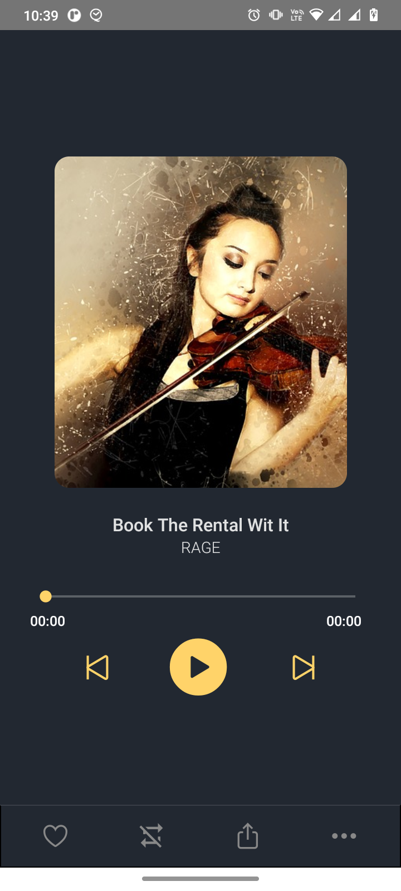
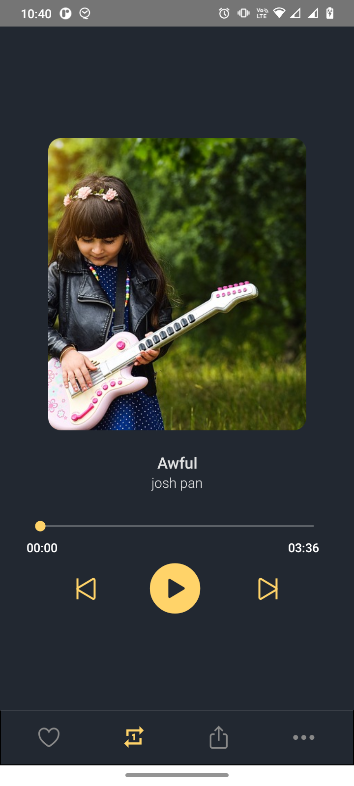

# MusicPlayerApp

Um reprodutor de musicas simples feito em React Native. A aplicação foi desenvolvida para aprender como utilizar a biblioteca react-native-track-player, segui [esse tutorial](https://www.youtube.com/watch?v=dPw5vCXhrmc) para fazer o app.

<br/>
  <p align = "center"></p>
<br/>

<p align="center">
    
    
</p>

<p align="center">
       
</p>

## :iphone: Tecnologias
- `React Native`
- `react-native-track-player`
- `react-native-vector-icons`
___

## 💻 Instalação

Clone o projeto e acesse a sua pasta:

```sh
$ git clone https://github.com/thiagoemanoel98/MusicPlayerApp.git
$ cd MusicPlayerApp
```

Instale as dependências do projeto e inicie:

```sh
# Dependências
$ npm install
   ou
$ yarn

# Start Android
$ npx react-native run-android
   ou
$ yarn android

# Start IOS
npx react-native run-ios
   ou
$ yarn android
```

___

Made with :coffee: by Thiago Emanoel :v:
